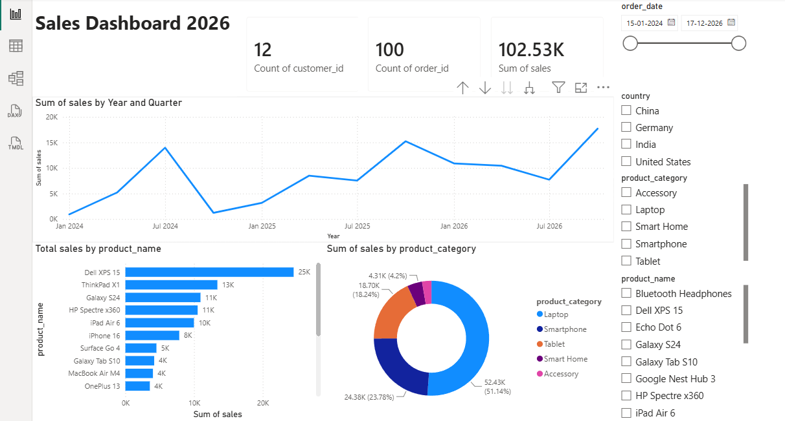

# Sales Dashboard 2026 - Power BI

## Project Overview

This Power BI dashboard provides an interactive analysis of sales performance across different countries, product categories, and products. It helps users monitor sales trends, identify top-performing products, and analyze category-wise revenue distribution.

## Tools Used

- Power BI Desktop
- DAX
- Data Modeling
- Data Visualization

## Dashboard Features

### KPI Cards
- Total Customers: 12
- Total Orders: 100
- Total Sales: 102.53K

### Interactive Filters
- Order Date Range
- Country Filter
- Product Category Filter
- Product Name Filter

### Visualizations
- Sales Trend by Year and Quarter (Line Chart)
- Total Sales by Product (Bar Chart)
- Sales Distribution by Product Category (Donut Chart)

## Key Insights

- Dell XPS 15 is the top-selling product with approximately 25K sales.
- Laptop category contributes more than 50% of total sales.
- Sales show consistent growth from 2024 to 2026.
- Multiple filters allow detailed analysis by country and product category.

## Dashboard Preview

## Skills Demonstrated

- Business Intelligence
- Data Analysis
- Dashboard Development
- Data Visualization
- DAX Calculations
- KPI Reporting
- Interactive Filtering

## Repository Contents

- BASIC POWER BI.pbix
- powerbi_dashboard.png
- README.md

## Author

Deepika Gopi
